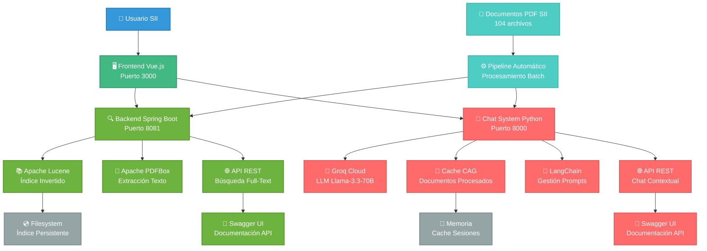
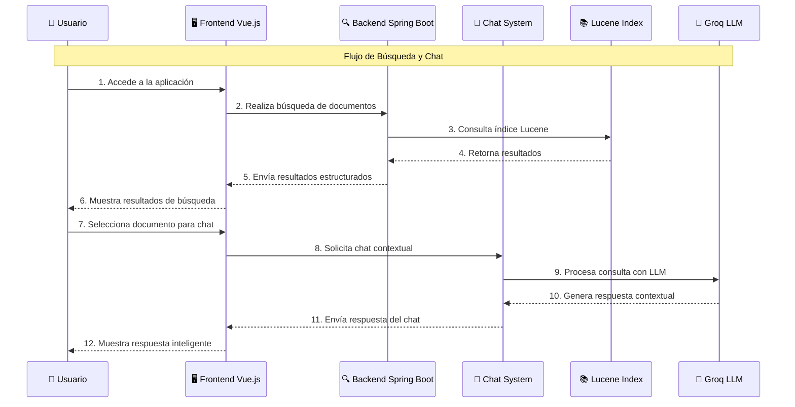
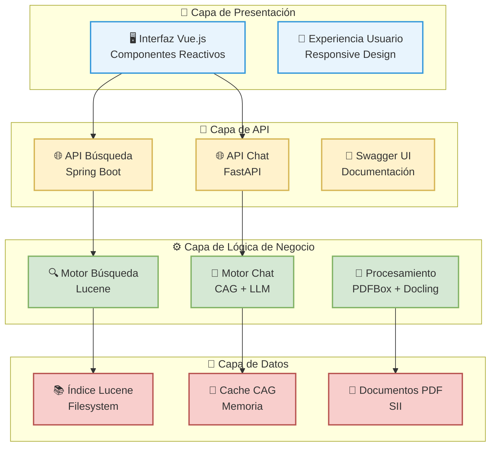
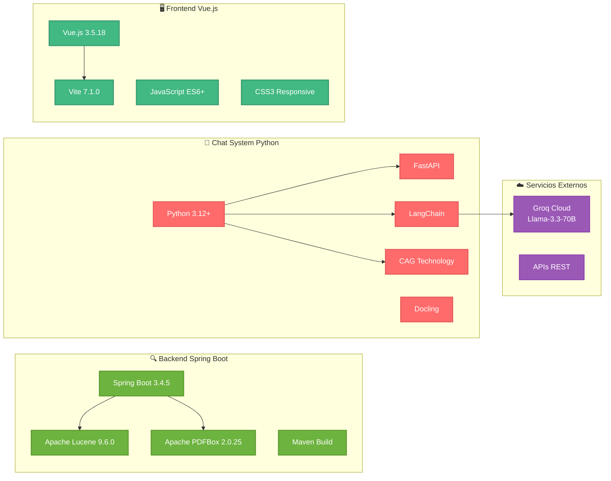
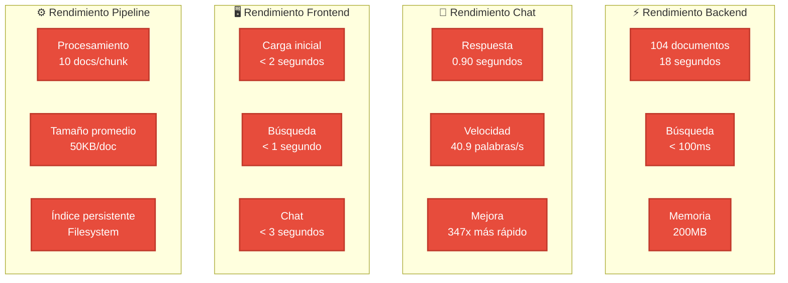
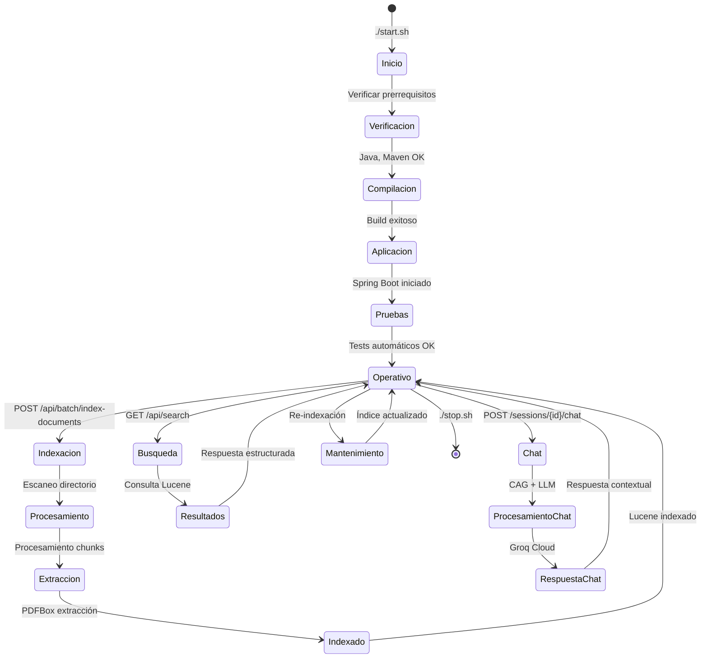

# 🏗️ DIAGRAMA DE ARQUITECTURA - SOLUCIÓN INFORMÁTICA INTEGRAL SII

## 📊 **Diagrama Principal de Arquitectura**



## 🔄 **Flujo de Datos Principal**



## 🏗️ **Arquitectura por Capas**



## 🔧 **Componentes Técnicos Detallados**



## 📊 **Métricas de Rendimiento**



## 🔄 **Ciclo de Vida del Sistema**



## 🎯 **Casos de Uso Principales**

```mermaid
graph TD
    subgraph "🔍 Caso 1: Búsqueda de Documentos"
        U1[👤 Usuario] --> B1[🔍 Busca "IVA"]
        B1 --> R1[📋 Resultados relevantes]
        R1 --> S1[📄 Selecciona documento]
    end
    
    subgraph "💬 Caso 2: Chat Contextual"
        U2[👤 Usuario] --> C1[💬 Pregunta sobre ley]
        C1 --> P1[🧠 CAG procesa documento]
        P1 --> LLM1[🤖 LLM genera respuesta]
        LLM1 --> A1[💡 Respuesta contextual]
    end
    
    subgraph "⚙️ Caso 3: Pipeline Automático"
        D1[📁 Nuevos documentos] --> P2[⚙️ Pipeline detecta]
        P2 --> I1[📚 Indexación automática]
        I1 --> D2[✅ Disponible para búsqueda]
    end
    
    classDef user fill:#3498db,stroke:#2980b9,stroke-width:2px,color:#fff
    classDef process fill:#e67e22,stroke:#d35400,stroke-width:2px,color:#fff
    classDef result fill:#27ae60,stroke:#229954,stroke-width:2px,color:#fff
    
    class U1,U2 user
    class B1,C1,P1,LLM1,P2,I1 process
    class R1,S1,A1,D2 result
```

---

## 📋 **Resumen del Diagrama**

### **Componentes Principales:**
1. **🖥️ Frontend Vue.js** - Interfaz de usuario moderna y responsive
2. **🔍 Backend Spring Boot** - Motor de búsqueda con Apache Lucene
3. **💬 Chat System Python** - Sistema inteligente con CAG y Groq Cloud
4. **⚙️ Pipeline Automático** - Procesamiento automatizado de documentos

### **Flujos Principales:**
1. **Búsqueda**: Usuario → Frontend → Backend → Lucene → Resultados
2. **Chat**: Usuario → Frontend → Chat System → CAG → Groq → Respuesta
3. **Pipeline**: Documentos → Procesamiento → Indexación → Disponible

### **Tecnologías Clave:**
- **Vue.js 3** + **Vite** para frontend moderno
- **Spring Boot** + **Apache Lucene** para búsqueda eficiente
- **Python** + **FastAPI** + **CAG** + **Groq** para chat inteligente
- **Pipeline automatizado** para procesamiento de documentos

---

*Diagramas generados para la Solución Informática Integral SII*  
*Versión: 1.0 - Enero 2025*
