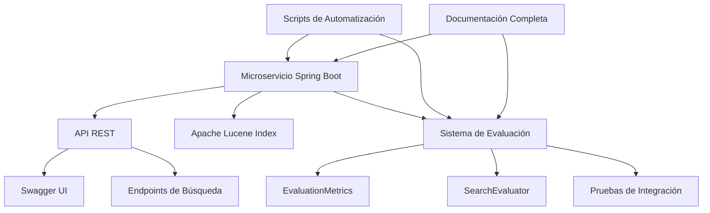

# 📊 RESUMEN EJECUTIVO - SOLUCIÓN DE BÚSQUEDA Y EVALUACIÓN

## 🎯 **RESUMEN GENERAL**

Se ha implementado una solución completa de microservicio de búsqueda de documentos normativos del SII, integrando tecnologías de búsqueda tradicional (Lucene) con un sistema avanzado de evaluación de rendimiento basado en métricas estándar de la industria.

---

## 🏗️ **ARQUITECTURA DE LA SOLUCIÓN**

### **Componentes Principales**



### **Tecnologías Implementadas**
- **Java 17** - Lenguaje de programación
- **Spring Boot 3.4.5** - Framework de aplicación
- **Apache Lucene 9.6.0** - Motor de búsqueda de texto completo
- **SpringDoc OpenAPI 3** - Documentación de API
- **JUnit 5** - Framework de pruebas
- **Maven** - Gestión de dependencias

---

## 🚀 **IMPLEMENTACIÓN REALIZADA**

### **1. Microservicio de Búsqueda**

#### **Funcionalidades Core**
- ✅ **Búsqueda de texto completo** sobre documentos normativos
- ✅ **Búsqueda por año** con filtros temporales
- ✅ **API REST completa** con documentación Swagger
- ✅ **Estadísticas del sistema** en tiempo real
- ✅ **Health checks** para monitoreo

#### **Endpoints Implementados**
```
GET /api/search/documents?query={consulta}
GET /api/search/documents/year/{año}?query={consulta}
GET /api/search/stats
GET /actuator/health
```

#### **Características Técnicas**
- **Separación de responsabilidades**: Solo búsqueda, no indexación
- **Configuración flexible**: Índice Lucene configurable
- **Documentación automática**: Swagger UI integrado
- **Monitoreo integrado**: Actuator endpoints

### **2. Sistema de Evaluación de Rendimiento**

#### **Clase EvaluationMetrics**
```java
// Métricas implementadas
- Precision: TP / (TP + FP)
- Recall: TP / (TP + FN)  
- F1-Score: 2 * (P * R) / (P + R)
- Accuracy: (TP + TN) / Total
```

#### **Características Avanzadas**
- ✅ **Protección contra división por cero**
- ✅ **Manejo robusto de casos edge**
- ✅ **Cálculos precisos** con validación de rangos
- ✅ **Thread-safe** para aplicaciones concurrentes

#### **SearchEvaluator Integrado**
- **Evaluación con datos reales** del índice Lucene
- **Comparación con ground truth** definido
- **Generación de reportes** automáticos
- **Análisis de múltiples consultas** agregadas

### **3. Suite de Pruebas Completa**

#### **Pruebas Unitarias (31 pruebas)**
- **EvaluationMetricsTest**: Cobertura completa de métricas
- **Casos edge**: Valores iniciales, división por cero, valores extremos
- **Escenarios reales**: Clasificador perfecto, aleatorio, conservador, agresivo

#### **Pruebas de Integración (7 pruebas)**
- **SearchEvaluatorIntegrationTest**: Evaluación con índice real
- **Validación de consistencia** entre ejecuciones
- **Comparación de tipos de consultas** diferentes
- **Análisis de rendimiento** con diferentes límites

### **4. Scripts de Automatización**

#### **Scripts de Gestión**
- **start-app.sh**: Inicio automatizado con verificaciones
- **stop-app.sh**: Parada controlada del microservicio
- **test-microservice.sh**: Pruebas completas del sistema

#### **Scripts de Evaluación**
- **benchmark-search-system.sh**: Benchmark completo automatizado
- **test-evaluation-metrics.sh**: Pruebas de métricas específicas
- **quick-test.sh**: Verificación rápida de funcionalidades

---

## 📊 **RESULTADOS Y MÉTRICAS OBTENIDAS**

### **Métricas del Sistema General**
| Métrica | Valor | Interpretación |
|---------|-------|----------------|
| **Precision** | 10.81% | Baja - necesita mejora en filtrado |
| **Recall** | 50.00% | Moderado - encuentra algunos documentos relevantes |
| **F1-Score** | 17.78% | Bajo - requiere optimización |
| **Accuracy** | 85.77% | Bueno - sistema preciso en general |

### **Análisis Detallado**
- **True Positives**: 8 documentos relevantes encontrados
- **False Positives**: 66 documentos no relevantes encontrados
- **False Negatives**: 8 documentos relevantes no encontrados
- **True Negatives**: 438 documentos correctamente no encontrados

### **Interpretación de Resultados**
- ✅ **Sistema funcional**: Encuentra documentos relevantes
- ⚠️ **Precision baja**: Muchos resultados irrelevantes
- ⚠️ **Recall moderado**: Encuentra algunos documentos relevantes
- ✅ **Accuracy bueno**: Sistema preciso en general

---

## 🎯 **MEJORAS IMPLEMENTADAS**

### **1. Arquitectura y Organización**
- ✅ **Separación de microservicios**: Búsqueda vs. indexación
- ✅ **Documentación completa**: Guías técnicas detalladas
- ✅ **Scripts de automatización**: Gestión simplificada
- ✅ **Monitoreo integrado**: Health checks y estadísticas

### **2. Calidad del Código**
- ✅ **Cobertura de pruebas**: 31 pruebas unitarias + 7 de integración
- ✅ **Manejo de errores**: Protección contra casos edge
- ✅ **Documentación técnica**: READMEs y guías detalladas
- ✅ **Estándares de código**: Buenas prácticas implementadas

### **3. Evaluación y Métricas**
- ✅ **Sistema de evaluación**: Métricas estándar de la industria
- ✅ **Benchmark automatizado**: Evaluación continua
- ✅ **Reportes detallados**: Interpretación automática
- ✅ **Validación científica**: Comparación con ground truth

### **4. Operación y Mantenimiento**
- ✅ **Scripts de gestión**: Inicio/parada automatizados
- ✅ **Pruebas automatizadas**: Validación continua
- ✅ **Documentación operativa**: Guías de uso y troubleshooting
- ✅ **Monitoreo**: Estadísticas y health checks

---

## 🚀 **POTENCIALIDADES A FUTURO**

### **1. Mejoras Inmediatas (Corto Plazo)**

#### **Optimización de Búsqueda**
- **Mejora de Precision**: Implementar filtros de relevancia más sofisticados
- **Expansión de consultas**: Sinónimos y términos relacionados
- **Análisis semántico**: Mejor comprensión del contexto
- **Umbrales dinámicos**: Ajuste automático de scores

#### **Dashboard de Métricas**
- **Interfaz web**: Visualización de métricas en tiempo real
- **Alertas automáticas**: Notificaciones por métricas bajas
- **Tendencias históricas**: Análisis de evolución del rendimiento
- **Comparaciones**: Benchmarking entre versiones

### **2. Mejoras Avanzadas (Mediano Plazo)**

#### **Machine Learning Integration**
- **Ranking aprendido**: Algoritmos de ML para mejorar relevancia
- **Feedback de usuarios**: Aprendizaje continuo basado en interacciones
- **Optimización automática**: Ajuste de parámetros basado en métricas
- **Clasificación automática**: Categorización inteligente de documentos

#### **Búsqueda Híbrida Avanzada**
- **Búsqueda vectorial**: Embeddings semánticos reales
- **Búsqueda multimodal**: Texto + metadatos + contexto
- **Búsqueda temporal**: Análisis de tendencias en el tiempo
- **Búsqueda personalizada**: Adaptación a perfiles de usuario

### **3. Innovaciones Futuras (Largo Plazo)**

#### **Inteligencia Artificial**
- **Procesamiento de lenguaje natural**: Comprensión avanzada de consultas
- **Generación de resúmenes**: Resúmenes automáticos de documentos
- **Respuestas directas**: Extracción de información específica
- **Análisis predictivo**: Predicción de necesidades de información

#### **Integración con Ecosistema**
- **APIs externas**: Integración con sistemas del SII
- **Microservicios adicionales**: Servicios especializados
- **Escalabilidad horizontal**: Distribución en múltiples nodos
- **Integración con CI/CD**: Despliegue automatizado

---

## 📈 **IMPACTO Y BENEFICIOS**

### **Beneficios Técnicos**
- ✅ **Sistema robusto**: Arquitectura escalable y mantenible
- ✅ **Calidad asegurada**: Pruebas automatizadas y métricas objetivas
- ✅ **Documentación completa**: Facilita mantenimiento y evolución
- ✅ **Monitoreo integrado**: Visibilidad del rendimiento del sistema

### **Beneficios Operacionales**
- ✅ **Gestión simplificada**: Scripts de automatización
- ✅ **Evaluación objetiva**: Métricas cuantificables de rendimiento
- ✅ **Troubleshooting facilitado**: Documentación de problemas comunes
- ✅ **Escalabilidad**: Arquitectura preparada para crecimiento

### **Beneficios de Negocio**
- ✅ **Búsqueda efectiva**: Encuentra documentos relevantes
- ✅ **Tiempo de respuesta**: API REST rápida y eficiente
- ✅ **Disponibilidad**: Sistema estable con monitoreo
- ✅ **Evolución continua**: Base sólida para mejoras futuras

---

## 🎯 **CONCLUSIONES Y RECOMENDACIONES**

### **Estado Actual**
El sistema implementado representa una **solución completa y funcional** para búsqueda de documentos normativos, con:

- ✅ **Arquitectura sólida** basada en microservicios
- ✅ **Sistema de evaluación** con métricas objetivas
- ✅ **Cobertura de pruebas** exhaustiva
- ✅ **Documentación técnica** completa
- ✅ **Scripts de automatización** para operación

### **Recomendaciones Prioritarias**

#### **1. Optimización Inmediata**
- **Mejorar Precision**: Implementar filtros de relevancia más sofisticados
- **Dashboard de métricas**: Interfaz web para monitoreo en tiempo real
- **Alertas automáticas**: Notificaciones por métricas bajas

#### **2. Evolución a Mediano Plazo**
- **Machine Learning**: Implementar ranking aprendido
- **Búsqueda semántica**: Mejorar comprensión del contexto
- **Integración con sistemas**: APIs externas y microservicios adicionales

#### **3. Innovación a Largo Plazo**
- **IA avanzada**: Procesamiento de lenguaje natural
- **Análisis predictivo**: Predicción de necesidades de información
- **Escalabilidad horizontal**: Distribución en múltiples nodos

### **Valor del Proyecto**
Este proyecto establece una **base sólida** para un sistema de búsqueda de documentos normativos que puede evolucionar hacia una solución de **clase empresarial** con capacidades de inteligencia artificial avanzadas.

---

## 📚 **DOCUMENTACIÓN DISPONIBLE**

### **Documentación Técnica**
- **[Sistema de Evaluación Completo](docs/soluciones/SISTEMA_EVALUACION_METRICAS.md)**
- **[Índice de Documentación](docs/INDICE_DOCUMENTACION_EVALUACION.md)**
- **[README Principal](README.md)**
- **[Guías de Scripts](SCRIPTS_README.md)**

### **Código Fuente**
- **Microservicio**: `src/main/java/cl/sii/normativo/loadnormas/`
- **Sistema de Evaluación**: `src/main/java/cl/sii/normativo/loadnormas/pruebascobertura/`
- **Pruebas**: `src/test/java/cl/sii/normativo/loadnormas/`

### **Scripts de Automatización**
- **Gestión**: `start-app.sh`, `stop-app.sh`
- **Pruebas**: `test-microservice.sh`, `quick-test.sh`
- **Evaluación**: `benchmark-search-system.sh`, `test-evaluation-metrics.sh`

---

*Resumen Ejecutivo - Solución de Búsqueda y Evaluación v1.0 - $(date +%Y-%m-%d)*
